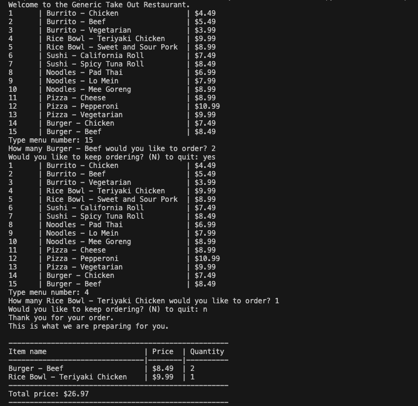

# Takeout-Restaurant-Order-System
Using Python to build out a program that allows customers to place orders with a takeout restaurant, and receive an itemized receipt.
 

 ## Table of Contents
  * [Installation](#installation)
  * [Usage](#usage)
  * [License](#license)
  * [Contributing](#contributing)
  * [Credits](#credits)
  * [Questions](#questions)
  

  ## Installation
  To install the necessary dependencies, run the following command:
  - python3 restaurant.py
 

  ## Usage
  
  ## Here is the main page
  
 
  

  ## Credits 
  Starter code credit to Rutgers boot camp 

  ## License
  This project is license under MIT. 
    
    
    
    
  
  
  ## Contributing
  According to github, on learning how to contribute to someones repo, you can use a fork and pull request1. 
  Here is a link to the github documentation on how to fork and pull request: [Github Documentation](https://docs.github.com/en/get-started/exploring-projects-on-github/contributing-to-a-project)
  Since this is an open source project, check out the this link on contributor covenant: [Contributor Covenant](https://www.contributor-covenant.org/) This is a code of conduct for open source projects.
  

  
  ## Questions
  If you have any questions about this repo, please contact me directly at marqueljamal12@gmail.com. You can find more of my work on github at [marquel12](https://github.com/marquel12/Kanban-Board) 